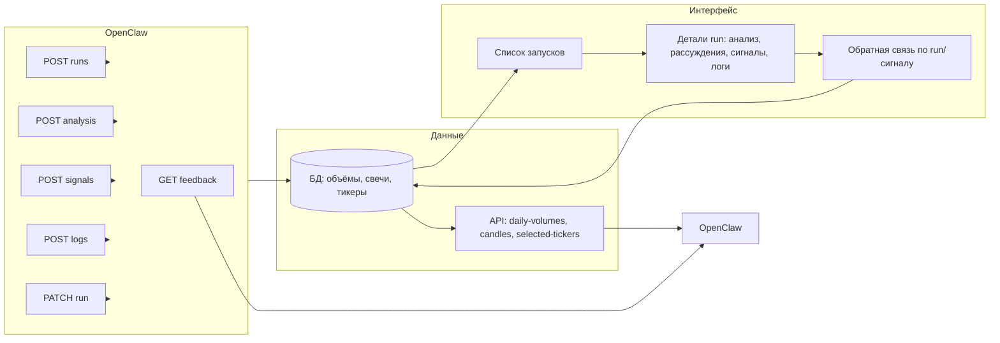

# План: интерфейс обучения OpenClaw и анализа данных для формирования стратегии

## Контекст

- Уже есть: приложение [agent](c:\Projects\Traiding\agent\) (модели AgentRun, AgentAnalysis, AgentSignal, AgentLog), API для создания run и отправки analysis/signals/logs, дашборд [agent/dashboard](c:\Projects\Traiding\agent\templates\agent\dashboard.html) и страница детали run [run_detail.html](c:\Projects\Traiding\agent\templates\agent\run_detail.html).
- Цель: пользователь видит процесс анализа, понимает, как OpenClaw думает (пошаговые рассуждения, какие правила из [descr.txt](c:\Projects\Traiding\descr.txt) применены), и может корректировать рассуждения; на основе этого формируется и уточняется стратегия.

---

## 1. Пошаговые рассуждения агента (chain-of-thought)

**Задача:** чтобы «видеть, как думает» OpenClaw, агент должен присылать не только итоговый вывод, но и шаги рассуждения.

**Реализация:**

- Расширить контракт анализа: тип `reasoning_step` (добавить в [AgentAnalysis.ANALYSIS_TYPE_CHOICES](c:\Projects\Traiding\agent\models.py)) и единый формат `content` для шага:
  - `step` (порядковый номер), `description` (текст шага), `input_data` (использованные данные: символ, метрики, уровни), `conclusion` (вывод шага), опционально `rule` (идентификатор правила из стратегии, см. п. 2).
- OpenClaw при анализе шлёт в `POST .../analysis/` массив записей с `analysis_type: "reasoning_step"` и таким `content`; при необходимости — отдельно итоговые записи типов `volume_anomaly`, `poc_hvn` и т.д.
- В [run_detail.html](c:\Projects\Traiding\agent\templates\agent\run_detail.html): блок **«Ход рассуждений»** — отображать все записи с типом `reasoning_step` в хронологическом порядке (шаг, описание, вывод, правило при наличии). Остальные типы анализа оставить в текущей таблице «Анализ».

**Итог:** в интерфейсе видна последовательность мыслей агента по каждому run.

---

## 2. Привязка к правилам стратегии (descr)

**Задача:** понимать, какое правило Volume-POC применено к решению; связь с [descr.txt](c:\Projects\Traiding\descr.txt).

**Реализация:**

- Ввести справочник правил (одна модель или JSON в настройках): идентификатор + короткое название + фрагмент текста из descr. Минимальный вариант: константы в коде или один JSON-файл в репозитории (например `agent/strategy_rules.json`) с полями `id`, `name`, `excerpt` для правил «Торговля от уровня», «Торговля на возврат», «Стоп за границей зоны», «Фильтр: рядом с зоной» и т.д.).
- В контракте анализа и сигнала: поле `rule` (строка или id) — какое правило применено. OpenClaw заполняет его при отправке analysis/signals.
- В UI на странице run: в блоке рассуждений и в таблице сигналов показывать «Правило: …» с подсказкой (всплывающее окно или раскрывающийся текст с excerpt). Опционально: отдельная страница «Стратегия» — список правил с текстом из descr и ссылками на последние runs, где правило использовалось.

**Итог:** по каждому решению видно, какое правило стратегии применено и как оно сформулировано.

---

## 3. Обратная связь пользователя (коррекция рассуждений)

**Задача:** возможность корректировать рассуждения агента и давать ему обратную связь для обучения.

**Реализация:**

- Новая модель **AgentFeedback**: связь с run (FK на AgentRun) и опционально с конкретным сигналом (FK на AgentSignal, null = отзыв на весь run); тип `feedback_type` (correction / override / approve); текст `comment`; дата и пользователь (request.user при создании через UI).
- API: `POST /api/agent/runs/<id>/feedback/` — создание обратной связи (тело: опционально `signal_id`, `feedback_type`, `comment`). `GET /api/agent/runs/<id>/feedback/` — список обратной связи по run (для OpenClaw и для UI).
- В [run_detail.html](c:\Projects\Traiding\agent\templates\agent\run_detail.html): у каждого сигнала кнопка «Скорректировать» / «Оспорить»; форма (модальное окно или отдельный блок): выбор типа (коррекция / отклонить / одобрить), текстовое поле. У run — кнопка «Добавить комментарий к запуску» (обратная связь без signal_id). Вывод существующей обратной связи под блоком сигналов и в блоке «Summary» run.
- В README или отдельном документе для OpenClaw: описание формата feedback и рекомендация периодически запрашивать `GET .../runs/<id>/feedback/` по завершённым runs и учитывать в дообучении или в следующих запусках.

**Итог:** пользователь видит решения агента и может их скорректировать; OpenClaw получает обратную связь через API и может на ней учиться.

---

## 4. Типы запусков и режим «анализ / обучение»

**Задача:** различать запуски «только анализ данных» и «обучение» (и при необходимости «демо-торговля»), чтобы в интерфейсе фильтровать и понимать контекст.

**Реализация:**

- В [AgentRun](c:\Projects\Traiding\agent\models.py): поле `run_type` (например `analysis` / `training` / `demo` / `live`) — сохранять в `input_params` или вынести в отдельное поле. Рекомендуется отдельное поле с choices для простой фильтрации в админке и на дашборде.
- OpenClaw при создании run передаёт `run_type` в теле `POST /api/agent/runs/` (или в `input_params.run_type`).
- На [dashboard](c:\Projects\Traiding\agent\templates\agent\dashboard.html): фильтр по типу запуска (анализ, обучение, демо). В списке — колонка «Тип».

**Итог:** в интерфейсе видно, какой запуск был анализом, какой — обучением, что упрощает формирование и проверку стратегии.

---

## 5. Документация контракта для OpenClaw

**Задача:** однозначный контракт для анализа данных и обучения.

**Реализация:**

- Файл в репозитории (например [docs/openclaw_api_contract.md](c:\Projects\Traiding\docs\)): описание сценария «Анализ данных» и «Обучение».
  - Анализ: создание run с `run_type=analysis`, входные параметры (дата, тикеры, интервал), отправка reasoning_step и итоговых анализов, при необходимости сигналов (как гипотезы), завершение run с summary.
  - Обучение: run с `run_type=training`, те же шаги + указание, что использованы данные за период X–Y; в summary — кратко результат (например «обновлены веса по N сценариям»).
- В документе: формат полей `content` для `reasoning_step`, перечень допустимых `rule` и ссылка на descr/strategy_rules, формат feedback (как читать и как использовать).

**Итог:** OpenClaw и разработчик руководствуются одним контрактом при интеграции и формировании стратегии.

---

## 6. Порядок внедрения

| Шаг | Действие | Результат |
|-----|----------|-----------|
| 1 | Добавить тип `reasoning_step` в AgentAnalysis; описать формат content в коде/документации; вывести блок «Ход рассуждений» на run detail | Видимость пошаговых рассуждений в UI |
| 2 | Справочник правил (JSON или модель); поле `rule` в контракте analysis/signal; отображение правила в run detail | Привязка решений к правилам стратегии |
| 3 | Модель AgentFeedback, API POST/GET feedback по run; форма и отображение обратной связи на run detail | Возможность корректировать рассуждения и читать feedback в OpenClaw |
| 4 | Поле run_type в AgentRun, фильтр на дашборде | Разделение запусков по типу (анализ/обучение/демо) |
| 5 | Документ openclaw_api_contract.md с форматами и сценариями | Контракт для анализа данных и формирования стратегии |

После этого интерфейс даёт: просмотр запусков и их типа, пошаговые рассуждения и применённые правила, сигналы с причиной и правилом, обратную связь по run/сигналу и её использование OpenClaw для уточнения стратегии.
